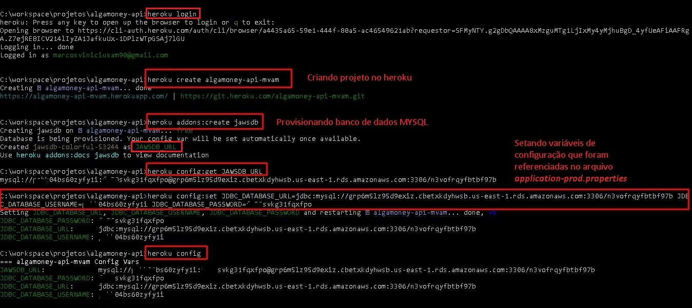

**Pr?-requisito**

1. Instale o cliente do Heroku (www.heroku.com)

**Deploy da API em produ??o**

1. Criando projeto e configurando Heroku (ver imagem abaixo)

2. Configurar no projeto os arquivos:

- application-prod.properties : ativar HTTPS, definir origem, colocar as vari?veis referenciadas 
								e setadas no Heroku para conex?o ao BD (ver imagem acima)
- Procfile : configurar este arquivo, indicando o nome do profile spring (prod), este nome 
             ser? utilizado para carregar o arquivo properties apropriado
			 

3. Commitar os arquivos;

4. Fazer push/deploy das altera??es.
- `git push heroku [branch]`
- Ex: `git push heroku master`      (vai subir todos os commits para o servidor do Heroku que j? est? em execu??o)

5. Para ver os logs da aplica??o:
- `heroku logs --tail`

-------------------------------------------------------------------------------------------------------------
 Failed to execute goal org.apache.maven.plugins:maven-resources-plugin:3.2.0:resources (default-resources) 
       on project algamoney-api: Input length = 1

- Tive o erro acima ao tentar fazer push para o Heroku
- Meus arquivos .properties estavam com encoding diferente de UTF-8. 
- **SOLU??O**: S? foi preciso excluir e recriar os arquivos (Bloco de notas) com UTF-8.